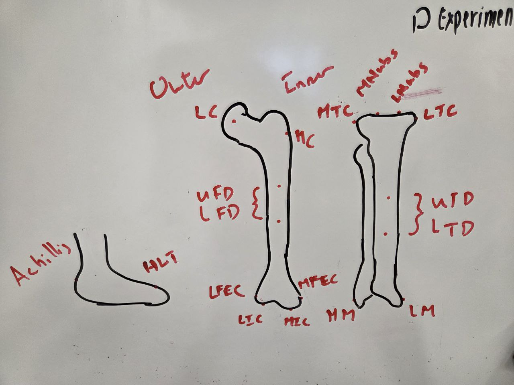

# Capstone Mechanical Axis

**_PLEASE WORK ON YOUR OWN BRANCH_**

## Mechanical Axis Theory

1. Take centre of head of femur and centre of distal femur
2. Axis at centre point of joint proximally to centre point of joint distally

## Usage

## Landmarks/Short Forms

### Thigh Bone
- uFH: upper femoral head
- FH: femoral head
- MC: medial condyle
- uFD: upper femoral diaphysis
- lFD: lower femoral diaphysis
- MFEC: medial femoral epicondyle
- LFEC: lateral femoral epicondyle

### Shin 
- LTC: lateral tibial condyle
- MTC: medial tibial condyle
- uTD: upper tibial diaphysis
- lTD: lower tibial diaphysis

### Foot
- Heel: Heel
- MM: medial malleolus
- LM: lateral mallelus
- Toe: Toe